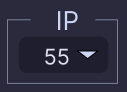

# vs-enclosures-config

Конфігуратор шаф

## Список шаф

Список шаф ( надалі <a id="list" style="text-decoration: none; color:#38B2AC;">СПИСОК</a> ) представляє собой **json** файл з масивом об'єктів, які описують структуру шафи.
Типізований об'єкт шафи

```ts
type EnclosureType = {
  id: string;
  // Виробник шафи
  manufacturer: "eldon" | "eta" | "vector VS";
  // Серія шафи (поки опціонально, в коді не використовується)
  series: "MKS" | "MKD" | "MCS" | "MCD" | "EKSS" | "Shark-VS";
  // Ступінь захисту шафи
  ip: number;
  // Виконання шафи
  type: "modular" | "compact";
  // Матеріал з якої виготовлено шафу
  material: "mild steel" | "stainless steel";
  // Опис структури шафи
  structure: {
    // Корпус шафи
    body: {
      // Габарити корпусу
      dimensions: {
        height: number; // Висота
        width: number; // Ширина
        depth: number; // Глибина
      };
      // Список id елементів, які додаються у специфікацію (надалі дані ключі будуть повторюватись)
      components: string[];
      // Список id обовязкових аксесуарів, які додаються у специфікацію (надалі дані ключі будуть повторюватись)
      mandatoryAccessories: string[] | null;
    };
    // Двері шафи
    door: {
      // Ключ, який вказує чи даний елемент шафи включений в складі шафи, іде окремим артикулом чи взагалі недоступний (надалі дані ключі будуть повторюватись)
      options: "detachedOptions" | "includedOptions" | null;
      // Варіанти у складі шафи
      includedOptions: {
        // Глухі двері
        plainDoor: {
          singleDoor: boolean; // Однодверний варіант
          doubleDoor: boolean; // Дводверний варіант
        };
        // Скляні двер
        glazedDoor: {
          singleDoor: boolean; // Однодверний варіант
          doubleDoor: boolean; // Дводверний варіант
        };
      } | null;
      // Варіанти як окремий артикул
      detachedOptions: {
        // Глухі двері
        plainDoor: {
          // Однодверний варіант
          singleDoor: {
            components: string[];
            mandatoryAccessories: string[] | null;
          } | null;
          // Дводверний варіант
          doubleDoor: {
            components: string[];
            mandatoryAccessories: string[] | null;
          } | null;
        };
        // Скляні двер
        glazedDoor: {
          // Однодверний варіант
          singleDoor: {
            components: string[];
            mandatoryAccessories: string[] | null;
          } | null;
          // Дводверний варіант
          doubleDoor: {
            components: string[];
            mandatoryAccessories: string[] | null;
          } | null;
        };
      } | null;
    };
    // Монтажна плата
    mountingPlate: {
      options: "detachedOptions" | "includedOptions" | null;
      includedOptions: true; // Вказує на те що плата в складі шафи
      // Варіанти плати як окремий артикул
      detachedOptions: {
        components: string[];
        mandatoryAccessories: string[] | null;
      } | null;
    };
    // Цоколь
    plinth: {
      options: "detachedOptions" | "includedOptions" | null;
      includedOptions: {
        // Варіанти у складі шафи
        100: boolean; // Висота цоколю 100
        200: boolean; // Висота цоколю 200
      } | null;
      // Варіанти як окремий артикул
      detachedOptions: {
        // Висота цоколю 100
        100: {
          components: string[];
          mandatoryAccessories: string[] | null;
        } | null;
        // Висота цоколю 200
        200: {
          components: string[];
          mandatoryAccessories: string[] | null;
        } | null;
      } | null;
    };
    // Дах шафи
    rainHood: {
      options: "detachedOptions" | "includedOptions" | null;
      includedOptions: true; // Дах у складі шафи
      // Варіанти як окремий артикул
      detachedOptions: {
        components: string[];
        mandatoryAccessories: string[] | null;
      } | null;
    };
    // Задня панель
    rearePanel: {
      options: "detachedOptions" | "includedOptions" | null;
      // Варіанти у складі шафи
      includedOptions: {
        // Задня панель
        rearPanel: boolean;
        // Глухі двері
        plainDoor: {
          singleDoor: boolean; // Однодверний варіант
          doubleDoor: boolean; // Дводверний варіант
        } | null;
        // Прозорі двері
        glazedDoor: {
          singleDoor: boolean; // Однодверний варіант
          doubleDoor: boolean; // Дводверний варіант
        };
      } | null;
      // Варіанти як окремий артикул
      detachedOptions: {
        // Задня панель
        rearPanel: {
          components: string[];
          mandatoryAccessories: string[] | null;
        } | null;
        // Глухі двері
        plainDoor: {
          // Однодверний варіант
          singleDoor: {
            components: string[];
            mandatoryAccessories: string[] | null;
          } | null;
          // Дводверний варіант
          doubleDoor: {
            components: string[];
            mandatoryAccessories: string[] | null;
          } | null;
        } | null;
        // Прозорі двері
        glazedDoor: {
          // Однодверний варіант
          singleDoor: {
            components: string[];
            mandatoryAccessories: string[] | null;
          } | null;
          // Дводверний варіант
          doubleDoor: {
            components: string[];
            mandatoryAccessories: string[] | null;
          } | null;
        };
      } | null;
    };
  };
};
```

## Структура фільтру

Тип <a id="filter" style="text-decoration: none; color:#61AFEF;">ФІЛЬТР</a>у для <a href="#filter_section" style="color: #38B2AC;">ВІДЖЕТ ФІЛЬТРІВ</a>

```ts
export type Filter = {
  // визначаємо основний конструктив
  manufacturer: string;
  type: string;
  material: string;
  ip: number;
  height: number | null;
  width: number | null;
  depth: number | null;
  mountingPlate: boolean;
  // визначаємо конструктивні елементи
  doorVisibility: "plainDoor" | "glazedDoor";
  doorConfiguration: "singleDoor" | "doubleDoor";
  rearPanel: "rearPanel" | "plainDoor" | "glazedDoor";
  rearPanelAsDoor: "singleDoor" | "doubleDoor";
  plinth: 100 | 200 | null;
  rainHood: boolean;
};
```

<section style="font-size: 16px">
  <h2 id="filter_section" style="color: tomato;">Віджет ФІЛЬТРИ</h2>
  <div style="text-align: center;">
    
  </div>
  <p>
    Містить селектори, за допомогую яких користувач має змогу сконфігурувати собі шафу, та отримати спеціфікацію всіх елементів. За кожний селект відповідає окремий ключ <a href="#filter" style="color: #38B2AC;">ФІЛЬТР</a>а
  </p>
  <div style="padding: 0 12px">
    <h3 id="filter_section" style="color: tomato;">Секція Виробник</h3>
    <div style="text-align: left;">
      
    </div>
   <p>
      Варіанти формуються з <a href="#list" style="color: #38B2AC;">СПИСОК</a>, по полю <strong     style="color:wheat">manufacturer</strong>
    </p>
   <p>Фільтрує варіанти шаф по виробнику, значенню ключа <a href="#filter" style="color: #38B2AC;">ФІЛЬТР</a>а <strong   style="color:wheat">manufacturer</strong></p>
  </div>
    <div style="padding: 0 12px">
    <h3 id="filter_section" style="color: tomato;">Секція IP</h3>
    <div style="text-align: left;">
      
    </div>
    <p>
      Варіанти формуються з <a href="#list" style="color: #38B2AC;">СПИСОК</a>, по полю <strong style="color:wheat">ip</strong>
    </p>
   <p>Фільтрує варіанти шаф по ступеню захисту ІР, значенню ключа <a href="#filter" style="color: #38B2AC;">ФІЛЬТР</a>а <strong   style="color:wheat">ip</strong></p>
  </div>
</section>
