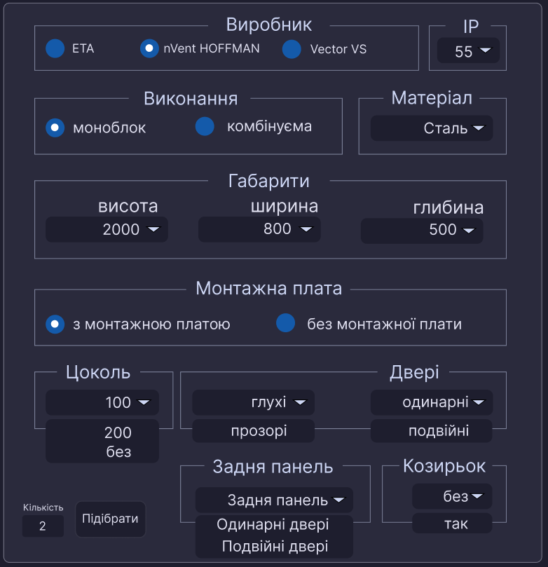
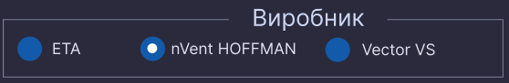

# Технічне завдання на Конфігуратор шаф

## :sparkles: Віджет ФІЛЬТРИ
  Містить селектори, за допомогую яких користувач має змогу сконфігурувати собі шафу, та отримати спеціфікацію всіх елементів. За кожний селект відповідає окремий ключ фільтра

[ФІЛЬТР](#фільтр)



### :collision: Секція Виробник



Фільтрує варіанти шаф по виробнику

Варіанти формуються з *[СПИСОК](#список-шаф)*, по ключу **`manufacturer`**

Ключ *[ФІЛЬТР](#фільтр)а* **`manufacturer`**, значення беруться з вибраного варіанту

### :collision: Секція IP


Фільтрує варіанти шаф по ступеню захисту

Варіанти формуються з *[СПИСОК](#список-шаф)*, по ключу **`ip`**

Ключ *[ФІЛЬТР](#фільтр)а* **`ip`**, значення беруться з вибраного варіанту

### :collision: Секція Виконання


Фільтрує варіанти шаф по способу виконання

Варіанти формуються з *[СПИСОК](#список-шаф)*, по ключу **`type`**

Ключ *[ФІЛЬТР](#фільтр)а* **`type`**, значення беруться з вибраного варіанту

### :collision: Секція Матеріал


Фільтрує варіанти шаф по матеріалу з якого виготовлено корпус

Варіанти формуються з *[СПИСОК](#список-шаф)*, по ключу **`material`**

Ключ *[ФІЛЬТР](#фільтр)а* **`material`**, значення беруться з вибраного варіанту

### :collision: Секція Габарити


Фільтрує варіанти шаф по розміру

Варіанти формуються з *[СПИСОК](#список-шаф)*, по ключам:

- Висота - **`structure.body.dimensions.height`**

- Ширина - **`structure.body.dimensions.width`**

- Глибина - **`structure.body.dimensions.depth`**

Ключі *[ФІЛЬТР](#фільтр)а* **`height`**|**`width`**|**`depth`**, значення беруться з вибраного варіанту

Початкове значення селектів **`не вибрано`**, значення ключів *[ФІЛЬТР](#фільтр)а* буде **`null`**

### :collision: Секція Монтажна плата


Вказує чи повинна бути в складі монтажна плата

Варіанти: **`з монтажною платою`** | **`без монтажної плати`**

Ключ *[ФІЛЬТР](#фільтр)а* **`mountingPlate`**, значення **`boolean`**

### :collision: Секція Цоколь


Вказує чи повинна бути в складі цоколь та його розмір

Варіанти: **`без`** | **`100`**| **`200`**

Ключ *[ФІЛЬТР](#фільтр)а* **`plinth`**, значення **`null`** | **`100`**| **`200`**

### :collision: Секція Двері


Вказує параметри дверей, містить 2 селектори

- **1й селектор**

  Варіанти: **`глухі`** | **`прозорі`**

  Ключ *[ФІЛЬТР](#фільтр)а* **`doorVisibility`**, значення **`plainDoor`** | **`glazedDoor`**

- **2й селектор**

  Варіанти: **`одинарні`** | **`подвійні`**

  Ключ *[ФІЛЬТР](#фільтр)а* **`doorConfiguration`**, значення **`singleDoor`** | **`doubleDoor`**

## :sparkles: Віджет СПЕЦИФІКАЦІЯ

## :sparkles: Віджет КАРТОЧКА ТОВАРУ

## ФІЛЬТР
Описує ключі для всіх селекторів у віджеті фільтрів
[ВІДЖЕТ ФІЛЬТРІВ](#sparkles-віджет-фільтри)

```ts
export type Filter = {
  // визначаємо основний конструктив
  manufacturer: string;
  type: string;
  material: string;
  ip: number;
  height: number | null;
  width: number | null;
  depth: number | null;
  mountingPlate: boolean;
  // визначаємо конструктивні елементи
  doorVisibility: "plainDoor" | "glazedDoor";
  doorConfiguration: "singleDoor" | "doubleDoor";
  rearPanel: "rearPanel" | "plainDoor" | "glazedDoor";
  rearPanelAsDoor: "singleDoor" | "doubleDoor";
  plinth: 100 | 200 | null;
  rainHood: boolean;
};
```
Перейти до віджета: [ФІЛЬТРИ](#sparkles-віджет-фільтри) | [СПЕЦИФІКАЦІЯ](#sparkles-віджет-специфікація) | [КАРТОЧКА ТОВАРУ](#sparkles-віджет-карточка-товару)

Перейти до секції віджета фільтрів: [виробник](#collision-секція-виробник) | [ip](#collision-секція-ip) | [виконання](#collision-секція-виконання) | [матеріал](#collision-секція-матеріал) | [габарити](#collision-секція-габарити) | [монтажна плата](#collision-секція-монтажна-плата) | [цоколь](#collision-секція-цоколь) | [двері](#collision-секція-двері)

## Список шаф
Список шаф ( надалі <a id="list" style="text-decoration: none; color:#38B2AC;">СПИСОК</a> ) представляє собой **json** файл з масивом об'єктів, які описують структуру шафи.
Типізований об'єкт шафи

```ts
type EnclosureType = {
  id: string;
  // Виробник шафи
  manufacturer: "eldon" | "eta" | "vector VS";
  // Серія шафи (поки опціонально, в коді не використовується)
  series: "MKS" | "MKD" | "MCS" | "MCD" | "EKSS" | "Shark-VS";
  // Ступінь захисту шафи
  ip: number;
  // Виконання шафи
  type: "комбінуєма" | "компактна";
  // Матеріал з якої виготовлено шафу
  material: "mild steel" | "stainless steel";
  // Опис структури шафи
  structure: {
    // Корпус шафи
    body: {
      // Габарити корпусу
      dimensions: {
        height: number; // Висота
        width: number; // Ширина
        depth: number; // Глибина
      };
      // Список id елементів, які додаються у специфікацію (надалі дані ключі будуть повторюватись)
      components: string[];
      // Список id обовязкових аксесуарів, які додаються у специфікацію (надалі дані ключі будуть повторюватись)
      mandatoryAccessories: string[] | null;
    };
    // Двері шафи
    door: {
      // Ключ, який вказує чи даний елемент шафи включений в складі шафи, іде окремим артикулом чи взагалі недоступний (надалі дані ключі будуть повторюватись)
      options: "detachedOptions" | "includedOptions" | null;
      // Варіанти у складі шафи
      includedOptions: {
        // Глухі двері
        plainDoor: {
          singleDoor: boolean; // Однодверний варіант
          doubleDoor: boolean; // Дводверний варіант
        };
        // Скляні двер
        glazedDoor: {
          singleDoor: boolean; // Однодверний варіант
          doubleDoor: boolean; // Дводверний варіант
        };
      } | null;
      // Варіанти як окремий артикул
      detachedOptions: {
        // Глухі двері
        plainDoor: {
          // Однодверний варіант
          singleDoor: {
            components: string[];
            mandatoryAccessories: string[] | null;
          } | null;
          // Дводверний варіант
          doubleDoor: {
            components: string[];
            mandatoryAccessories: string[] | null;
          } | null;
        };
        // Скляні двер
        glazedDoor: {
          // Однодверний варіант
          singleDoor: {
            components: string[];
            mandatoryAccessories: string[] | null;
          } | null;
          // Дводверний варіант
          doubleDoor: {
            components: string[];
            mandatoryAccessories: string[] | null;
          } | null;
        };
      } | null;
    };
    // Монтажна плата
    mountingPlate: {
      options: "detachedOptions" | "includedOptions" | null;
      includedOptions: true; // Вказує на те що плата в складі шафи
      // Варіанти плати як окремий артикул
      detachedOptions: {
        components: string[];
        mandatoryAccessories: string[] | null;
      } | null;
    };
    // Цоколь
    plinth: {
      options: "detachedOptions" | "includedOptions" | null;
      includedOptions: {
        // Варіанти у складі шафи
        100: boolean; // Висота цоколю 100
        200: boolean; // Висота цоколю 200
      } | null;
      // Варіанти як окремий артикул
      detachedOptions: {
        // Висота цоколю 100
        100: {
          components: string[];
          mandatoryAccessories: string[] | null;
        } | null;
        // Висота цоколю 200
        200: {
          components: string[];
          mandatoryAccessories: string[] | null;
        } | null;
      } | null;
    };
    // Дах шафи
    rainHood: {
      options: "detachedOptions" | "includedOptions" | null;
      includedOptions: true; // Дах у складі шафи
      // Варіанти як окремий артикул
      detachedOptions: {
        components: string[];
        mandatoryAccessories: string[] | null;
      } | null;
    };
    // Задня панель
    rearePanel: {
      options: "detachedOptions" | "includedOptions" | null;
      // Варіанти у складі шафи
      includedOptions: {
        // Задня панель
        rearPanel: boolean;
        // Глухі двері
        plainDoor: {
          singleDoor: boolean; // Однодверний варіант
          doubleDoor: boolean; // Дводверний варіант
        } | null;
        // Прозорі двері
        glazedDoor: {
          singleDoor: boolean; // Однодверний варіант
          doubleDoor: boolean; // Дводверний варіант
        };
      } | null;
      // Варіанти як окремий артикул
      detachedOptions: {
        // Задня панель
        rearPanel: {
          components: string[];
          mandatoryAccessories: string[] | null;
        } | null;
        // Глухі двері
        plainDoor: {
          // Однодверний варіант
          singleDoor: {
            components: string[];
            mandatoryAccessories: string[] | null;
          } | null;
          // Дводверний варіант
          doubleDoor: {
            components: string[];
            mandatoryAccessories: string[] | null;
          } | null;
        } | null;
        // Прозорі двері
        glazedDoor: {
          // Однодверний варіант
          singleDoor: {
            components: string[];
            mandatoryAccessories: string[] | null;
          } | null;
          // Дводверний варіант
          doubleDoor: {
            components: string[];
            mandatoryAccessories: string[] | null;
          } | null;
        };
      } | null;
    };
  };
};
```